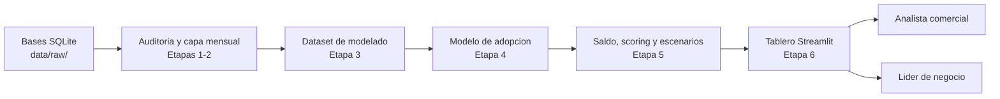

# Analítica de Inversiones CREAN

Solución analítica para identificar clientes con mayor probabilidad de adoptar la
nueva App de inversiones de CREAN y estimar el saldo potencial que podrían
canalizar durante los próximos 12 meses.

El diseño completo de la solución está en [`diseno_solucion.md`](diseno_solucion.md)
y el plan de implementación por etapas en [`guia_prompts.md`](guia_prompts.md).

> **Estado actual:** Etapas 1 a 6 implementadas (auditoría, capa mensual y
> proxy, dataset de modelado, modelo de adopción, saldo/scoring/escenarios y
> tablero Streamlit). Falta la Etapa 7 (integración y entrega final).

## Requisitos

- Windows
- Python **3.9.12**
- Sin Docker: toda la ejecución es local.

## Datos

Las siete bases SQLite originales deben ubicarse en `data/raw/`:

```text
data/raw/clientes.db
data/raw/estimador_ing.db
data/raw/crean_aho_cte.db
data/raw/crean_bolsillos.db
data/raw/crean_fiducuenta.db
data/raw/crean_inv_virtual_cdt.db
data/raw/invesbot.db
```

Los datos originales **no se modifican** en ningún paso del pipeline.

## Creación del entorno (Windows)

```powershell
py -3.9 -m venv venv
venv\Scripts\activate
python -m pip install --upgrade pip
pip install -r requirements.txt
```

Si ya existe un entorno virtual `venv/` con Python 3.9.12, basta con activarlo
e instalar las dependencias.

## Ejecución de las pruebas

```powershell
pytest
```

## Ejecución del inventario de fuentes (Etapa 1)

Verifica que las siete fuentes existan en `data/raw/` con la tabla esperada y
actualiza la sección correspondiente de `docs/reporte_validacion.md`:

```powershell
python run_pipeline.py --step inventario
```

Si falta un archivo o la tabla esperada no coincide, el comando finaliza con un
error explícito indicando qué fuente(s) fallaron.

## Estructura del repositorio

```text
data/
  raw/            Bases SQLite originales (no se modifican)
  interim/        Datos temporales regenerables (ignorados por Git)
  processed/      Datos procesados reutilizables entre etapas
src/
  config.py       Carga y validación de config.yaml
  data/           Catálogo de fuentes/productos e inventario
  features/       Construcción de variables (etapas posteriores)
  models/         Entrenamiento y scoring (etapas posteriores)
  reporting/      Utilidades para reportes Markdown consolidados
app/
  app.py          Tablero Streamlit (implementación completa en Etapa 6)
tests/            Pruebas automatizadas (pytest)
docs/
  reporte_validacion.md   Inventario, calidad, pruebas y reproducibilidad
legacy/           Script y reporte de auditoría exploratoria previos al pipeline
config.yaml       Configuración centralizada (rutas, semilla, parámetros)
run_pipeline.py   Punto de entrada del pipeline (ejecución completa o por etapa)
run_dashboard.py  Punto de entrada del tablero Streamlit
```

## Supuestos y limitaciones

Los supuestos analíticos y las limitaciones de la solución se documentan de
forma incremental en `docs/decisiones_analiticas.md` y en
[`diseno_solucion.md`](diseno_solucion.md) a medida que avanzan las etapas.

## Auditoría reproducible (Etapa 1)

La auditoría abre las siete bases SQLite en modo de solo lectura, ejecuta
consultas agregadas y actualiza una única sección idempotente en
`docs/reporte_validacion.md`.

```powershell
./venv/Scripts/python.exe run_pipeline.py --step auditoria
```

Para ejecutar todas las pruebas:

```powershell
./venv/Scripts/python.exe -m pytest -v
```

La auditoría no corrige datos, no imputa ausencias, no genera CSV auxiliares y
no interpreta las primeras apariciones como aperturas reales.

## Tablero (Etapa 6)

El tablero consume únicamente resultados ya precomputados (`outputs/`,
`artifacts/metadata/modelos.json`, `docs/reporte_analitico.md`); no entrena ni
recalcula modelos al iniciar. Requiere haber ejecutado antes `--step scoring`
y `--step modelo_adopcion`.

```powershell
./venv/Scripts/python.exe run_dashboard.py
# o directamente:
./venv/Scripts/python.exe -m streamlit run app/app.py
```

### Vistas

1. **Resumen ejecutivo**: clientes elegibles, adopciones esperadas, saldo
   esperado total, oportunidad por escenario (conservador/base/expansivo) y
   distribución de segmentos.
2. **Priorización**: filtros por segmento y nivel de confianza, matriz
   probabilidad de adopción vs. saldo potencial condicional, tabla priorizada
   con `numero_id` enmascarado y descarga en CSV.
3. **Modelo y calidad**: métricas de prueba temporal (PR-AUC, ROC-AUC, Brier,
   lift@10 %), estabilidad por corte, tasa por decil, importancia de
   variables, cobertura por fuente y limitaciones principales.

### Diagrama conceptual



### Actores

- **Analista comercial**: consulta la priorización para decidir a qué
  clientes contactar primero.
- **Líder de negocio**: revisa el resumen ejecutivo y los escenarios para
  dimensionar la oportunidad del lanzamiento.
- **Equipo analítico**: revisa la vista de modelo y calidad para validar
  desempeño, estabilidad y limitaciones antes de cada campaña.

### Entradas y salidas

- **Entradas**: `outputs/scoring_clientes.parquet`,
  `outputs/resumen_oportunidad.csv`, `artifacts/metadata/modelos.json`,
  `docs/reporte_analitico.md`.
- **Salidas**: visualizaciones interactivas y descarga de la tabla de
  priorización filtrada (CSV); el tablero no persiste archivos nuevos.

### Uso comercial

El tablero apoya la priorización inicial de clientes para el lanzamiento de
la nueva App de inversiones: identifica a quién contactar primero (segmentos
de alta probabilidad/alto valor) y dimensiona la oportunidad total bajo tres
escenarios explícitos. No sustituye una decisión comercial final ni garantiza
captación de dinero nuevo.

### Evolución futura

- Recalibrar el modelo con adopción real una vez la App esté disponible.
- Incorporar monitoreo de drift y reentrenamiento periódico.
- Añadir explicaciones individuales (SHAP) bajo demanda para clientes
  puntuales, en vez de solo razones globales.
- Evaluar un segundo modelo de saldo específico por producto si el volumen
  de adopción real lo justifica.

### Manejo de archivos faltantes

Si falta algún archivo de entrada, el tablero muestra un mensaje de error
claro indicando qué paso del pipeline ejecutar (por ejemplo,
`python run_pipeline.py --step scoring`), en vez de fallar sin explicación.
